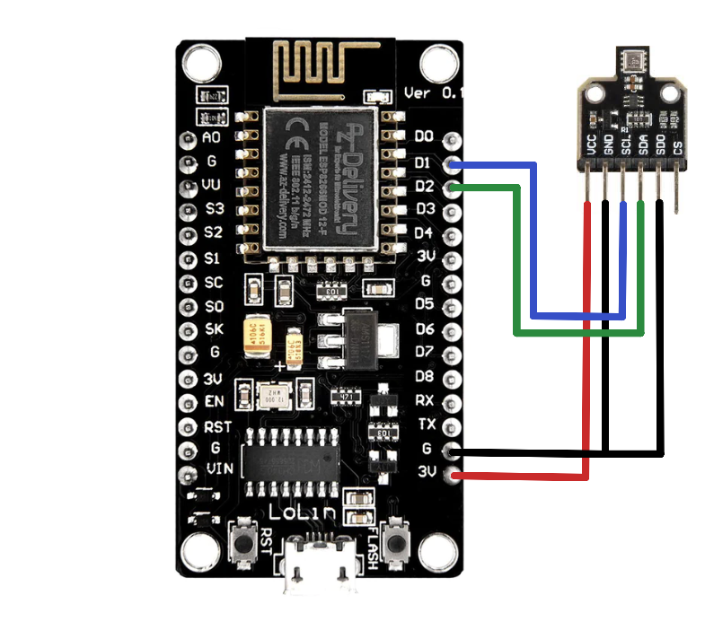

= BME680-Exporter for ESP8266

This sketch is meant to be a low power and low cost alternative to link:https://github.com/Dubhar/bme680_exporter[Dubhar/bme680_exporter].
For a more detailed comparison, see the chapter below.

== Requirements

* BME680 Breakout Board
* ESP8266 (tested on NodeMCU v3)
* Arduino IDE
** installed in Board Manager
*** link:https://github.com/esp8266/Arduino[esp8266] (by ESP8266 Community)
** installed in Library Manager
*** link:https://www.bosch-sensortec.com/software-tools/software/bsec[BSEC Software Library] (by Bosch Sensortec)
*** link:https://github.com/dvarrel/ESPAsyncWebSrv[ESPAsyncWebSrv] (by dvarrel)
** Setup:
*** close Arduino IDE
*** edit `platform.txt` on OS X for example `~/Library/Arduino15/packages/esp8266/hardware/esp8266/<VERSION>/platform.txt`
**** at the end of `# These can be overridden in platform.local.txt` block add: `compiler.libraries.ldflags=`
**** in the line starting with `recipe.c.combine.pattern=` check if there is `{compiler.libraries.ldflags}` present. If not append this right after `{compiler.c.elf.libs}`
*** open Arduino IDE
**** Tools -> MMU "16KB cache and 48KB IRAM"

== How to wire the sensor
Here is a wiring diagram of a joy-it BME680 breakout board and a NodeMCU v3.
Of course there are many other breakout board manufacturers and you should pay attention to their respective pinouts, see datasheets and or silkscreend text.
There are also ESP8266 boards available that may use different GPIO pins for I²C communication, this can be tweaked during wiring or in code, just be cautious!



== Prometheus

Here is a snippet of a `prometheus.yml` configuration
```
[...]
  - job_name: 'bme680'
    static_configs:
      - targets: ['192.168.178.22:80']
```

== Grafana

Here are some queries as starting point. Adjust them and make yourself a dashboard that suits you!

```
# simplest queries
bsec_compensated_temp

# queries with calculations (adjust pressure for temperature and measurement altitude of 186m)
((0.01*bsec_raw_pressure) * (1.0 - ((0.0065*186.0) / (bsec_compensated_temp + (0.0065 * 186.0) + 273.15)))^-5.257 )
```

== Comparison to link:https://github.com/Dubhar/bme680_exporter[Dubhar/bme680_exporter]

To compare power consumption:

* the tests were performed one after another
** first Pi Zero W
** second ESP8266 (NodeMCU v3)
* both tests were performed using the same
** USB power supply
** Micro USB cable
** BME680 breakout board (by joy-it)
** USB multimeter

The tests ran for 2:38h.
During the tests a Prometheus instance fetched the website every 15s.

|===
| Device | Cost(04.2023) [€] | Total draw [mAh]

| Pi Zero W with bme680_exporter | 25€(Pi)+17€(BME680)=*42€* | 245mAh
| ESP8266 with esp_bme680_exporter | 4€(ESP8266)+17€(BME680)=*21€* | 92mAh
|===
